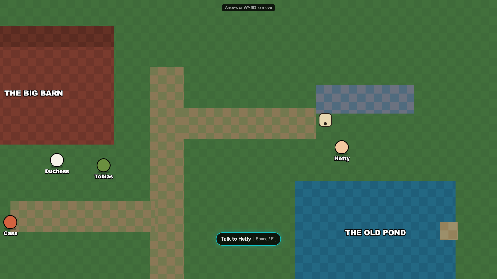

# The Farm

A browser game about **spotting logical fallacies** in a farmyard debate.

You play Rue, a donkey six weeks new to Green Meadows Farm. The Old Pond is going muddy, and
Duchess the goose has put a motion to the Public Farm: the pond should be reserved for her
flock, and the hoofed animals can drink from the trough by the road. She is charming, she has
forty-one birds behind her, and almost none of her argument is about the water.

Walk the farm, talk to the animals, and learn to tell the difference between what someone
*is* and what actually *happened* — first in low-stakes gossip at the trough, then in front
of the moderator.



---

## Running it

Requires [Node.js](https://nodejs.org).

```bash
npm install
npm run dev-nolog      # http://localhost:8080
```

| Command | What it does |
|---|---|
| `npm run dev` / `dev-nolog` | Dev server on port 8080 (`-nolog` skips the Phaser telemetry ping) |
| `npm run build` / `build-nolog` | Production build into `dist/` |
| `npm run lint` / `lint:fix` | ESLint over `src` |
| `npm run lint:styles` | Stylelint over SCSS |
| `npm run format` / `format:check` | Prettier |

There is **no test runner.** Changes are verified by running the app and driving it — see
[docs/architecture.md](docs/architecture.md#build-and-verification).

> `npm run dev` and `npm run build` send an anonymous ping to Phaser Studio recording the
> template name, dev-or-prod, and the Phaser version. The `-nolog` variants skip it; deleting
> `log.js` and its `scripts` entries removes it entirely.

---

## How it is built

**Phaser 3.90 and React 19 as siblings**, both drawn over one letterboxed 16:9 stage. Phaser
runs the overworld — walking, collision, camera. React runs everything the player reads or
clicks, including the entire debate system. They meet through Zustand stores and a typed
event bus.

The Phaser scene key decides which React overlay renders, so "changing screen" means starting
a scene.

| | |
|---|---|
| Engine | Phaser 3.90 |
| UI | React 19 + SCSS modules |
| State | Zustand |
| Build | Vite 6, TypeScript 5.7 (strict) |

```
src/
  types/    the content schema (scenarios, rounds, options, tutorials)
  data/     UI copy, the scenario registry, the farm map, the encounter JSON
  store/    four zustand stores
  phaser/   game config, scenes, the overworld
  react/    the debate UI, the tutorial system, the overworld overlay
```

All game content is authored as **data**, not code: an encounter is a JSON file plus one line
in `src/data/levels.ts`.

---

## Documentation

Start at **[docs/README.md](docs/README.md)**.

| If you want to… | Read |
|---|---|
| Understand how the app fits together | [docs/architecture.md](docs/architecture.md) |
| Write a new debate or encounter | [docs/encounters.md](docs/encounters.md) |
| Work on the overworld | [docs/farm_overworld.md](docs/farm_overworld.md) |
| Know what the game teaches | [docs/logical_fallacies_intro.md](docs/logical_fallacies_intro.md) |
| See a level built end to end | [docs/level_01_the_pond_motion.md](docs/level_01_the_pond_motion.md) |
| Find your way around the code | [AGENTS.md](AGENTS.md), and [src/react/AGENTS.md](src/react/AGENTS.md) for the debate UI |

---

## Credits

Built on the [Phaser React TypeScript template](https://github.com/phaserjs/template-react-ts).
Phaser is © Phaser Studio Inc., released under the MIT licence.
